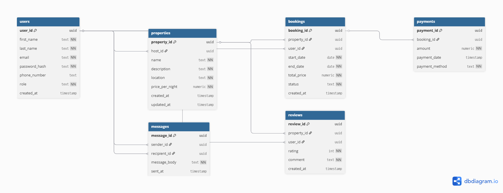

# AirBnB Database Design Requirements

## Project Overview
This document outlines the database schema and technical requirements for the ALX AirBnB project. The goal is to build a robust, scalable, and normalized relational database to manage users, property listings, bookings, payments, and communications.

---

## 1. Entities and Attributes

### Users
* **user_id**: Primary Key, UUID, Indexed. Unique identifier for each user.
* **first_name**: VARCHAR, NOT NULL.
* **last_name**: VARCHAR, NOT NULL.
* **email**: VARCHAR, UNIQUE, NOT NULL. Used for authentication.
* **password_hash**: VARCHAR, NOT NULL.
* **phone_number**: VARCHAR, NULL.
* **role**: ENUM ('guest', 'host', 'admin'), NOT NULL.
* **created_at**: TIMESTAMP, DEFAULT CURRENT_TIMESTAMP.

### Properties
* **property_id**: Primary Key, UUID, Indexed.
* **host_id**: Foreign Key, references `Users(user_id)`.
* **name**: VARCHAR, NOT NULL.
* **description**: TEXT, NOT NULL.
* **location**: VARCHAR, NOT NULL.
* **price_per_night**: DECIMAL, NOT NULL.
* **created_at**: TIMESTAMP, DEFAULT CURRENT_TIMESTAMP.
* **updated_at**: TIMESTAMP, ON UPDATE CURRENT_TIMESTAMP.

### Bookings
* **booking_id**: Primary Key, UUID, Indexed.
* **property_id**: Foreign Key, references `Properties(property_id)`.
* **user_id**: Foreign Key, references `Users(user_id)`.
* **start_date**: DATE, NOT NULL.
* **end_date**: DATE, NOT NULL.
* **total_price**: DECIMAL, NOT NULL.
* **status**: ENUM ('pending', 'confirmed', 'canceled'), NOT NULL.
* **created_at**: TIMESTAMP, DEFAULT CURRENT_TIMESTAMP.

### Payments
* **payment_id**: Primary Key, UUID, Indexed.
* **booking_id**: Foreign Key, references `Bookings(booking_id)`.
* **amount**: DECIMAL, NOT NULL.
* **payment_date**: TIMESTAMP, DEFAULT CURRENT_TIMESTAMP.
* **payment_method**: ENUM ('credit_card', 'paypal', 'stripe'), NOT NULL.

### Reviews
* **review_id**: Primary Key, UUID, Indexed.
* **property_id**: Foreign Key, references `Properties(property_id)`.
* **user_id**: Foreign Key, references `Users(user_id)`.
* **rating**: INTEGER, CHECK (rating >= 1 AND rating <= 5), NOT NULL.
* **comment**: TEXT, NOT NULL.
* **created_at**: TIMESTAMP, DEFAULT CURRENT_TIMESTAMP.

### Messages
* **message_id**: Primary Key, UUID, Indexed.
* **sender_id**: Foreign Key, references `Users(user_id)`.
* **recipient_id**: Foreign Key, references `Users(user_id)`.
* **message_body**: TEXT, NOT NULL.
* **sent_at**: TIMESTAMP, DEFAULT CURRENT_TIMESTAMP.

---

## 2. Relationships and Cardinality

The design follows these relational principles:

* **User to Property (1:N)**: A host can list multiple properties, but each property is managed by one host.
* **User to Booking (1:N)**: A guest can make multiple bookings.
* **Property to Booking (1:N)**: A property can have many bookings over its lifetime.
* **Booking to Payment (1:1)**: Each booking is associated with a single transaction record.
* **Property to Review (1:N)**: Each listing can receive multiple reviews from different guests.
* **User to Message (1:N)**: Users can send or receive multiple messages.

---

## 3. Technical Constraints & Indexing

### Constraints
1. **Primary Keys**: Every table uses a UUID as the primary key for global uniqueness and scalability.
2. **Foreign Keys**: Ensure referential integrity between related entities (e.g., a booking cannot exist without a valid user and property).
3. **ENUMs**: Restrict values for `role`, `status`, and `payment_method` to maintain data quality.
4. **Validation**: The `rating` field in the Review table must be between 1 and 5.

### Performance Optimization (Indexing)
To ensure fast query performance, the following indexes are implemented:
* **Users**: Index on `email` (for fast login lookups).
* **Properties**: Index on `property_id`.
* **Bookings**: Index on `property_id` and `booking_id`.
* **Payments**: Index on `booking_id`.
